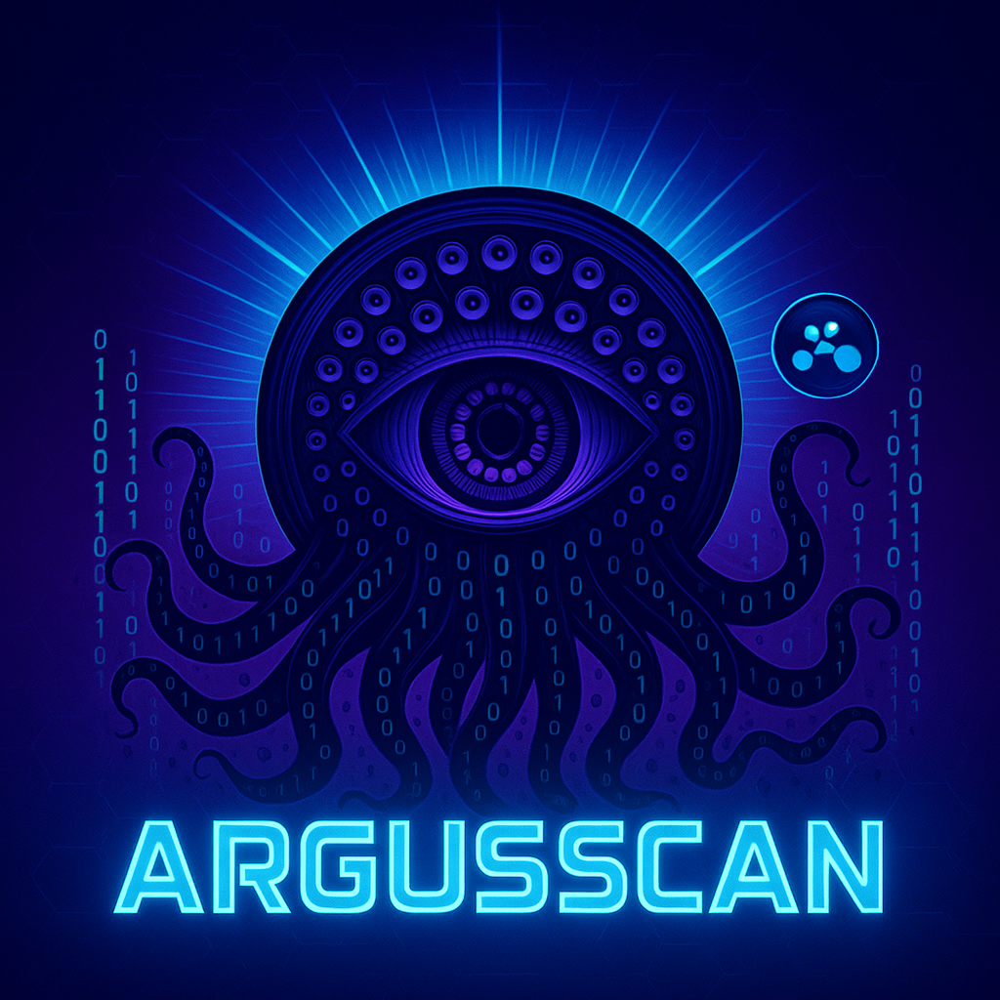

<div align="center">



# ArgusScan - Shodan Pentest Automation

> **Ethical Pentest Automation using Shodan API for cybersecurity professionals**

[](https://opensource.org/licenses/MIT)
[](https://www.python.org/downloads/)

</div>

## MANDATORY LEGAL WARNING

**This project is exclusively for ethical security and educational purposes.**

### Legal Notice

Unauthorized use of this tool for unauthorized access to systems is **ILLEGAL** and punishable by law:

- **Penalty**: Varies by jurisdiction
- **Criminal Liability**: Unauthorized access is a crime
- **Civil Liability**: Damage compensation

### Use ONLY for:

- Authorized **Bug Bounty**
- **Pentest** with signed contract and RoE (Rules of Engagement)
- Authorized **academic research**
- **Defensive security** of own systems
- Authorized **Red Team Exercises**

### NEVER use for:

- Unauthorized access to systems
- Unauthorized data modification
- Service interruption
- Any illegal activity

**Use of this tool implies acceptance of legal responsibility. Use ethically and with written authorization.**

---

## Table of Contents

- [Features](#-features)
- [Installation](#-installation)
- [Configuration](#-configuration)
- [Usage](#-usage)
- [Shodan Dorks Examples](#-shodan-dorks-examples)
- [Project Structure](#-project-structure)
- [Reports](#-reports)
- [Tool Integration](#-tool-integration)
- [Troubleshooting](#-troubleshooting)
- [Contributing](#-contributing)
- [License](#-license)

---

## Features

- **Shodan Search**: Full integration with Shodan API
- **Friendly CLI**: Colorful interface with Rich
- **Rate Limiting**: Respects API limits (1 req/second)
- **Multiple Formats**: Export Markdown, JSON, CSV
- **Advanced Filters**: By country, port, organization
- **Professional Reports**: PTES/OWASP template
- **CVSS Integration**: Vulnerability analysis support
- **Nuclei/ZAP Ready**: Export compatible with pentest tools

---

## Installation

### Prerequisites

- Python 3.8 or higher
- Shodan account with API key ([get it here](https://account.shodan.io/))

### Quick Installation

```bash
# Clone the repository
git clone https://github.com/your-username/argusscan.git
cd argusscan

# Install dependencies
pip install -r requirements.txt

# Configure your API key
# Edit config.yaml and add your Shodan API key
```

### Installation with Virtual Environment (Recommended)

```bash
# Create a virtual environment
python3 -m venv venv

# Activate the virtual environment
# Linux/Mac:
source venv/bin/activate
# Windows:
venv\Scripts\activate

# Install dependencies
pip install -r requirements.txt

# Install pre-commit hooks (optional but recommended)
pip install pre-commit
pre-commit install
```

---

## Configuration

### 1. Get Shodan API Key

1. Visit [https://account.shodan.io/](https://account.shodan.io/)
2. Create an account or login
3. Go to **Account** → **API Key**
4. Copy your API key

### 2. Use the Token

**IMPORTANT**: The token must be provided via `--token` (or `-t`) argument in **all** executions:

```bash
python argus_scan.py "vuln:CVE-2024-23897" --token YOUR_API_KEY
```

**Alternative (Optional)**: You can configure `config.yaml` as fallback, but CLI `--token` always takes priority:

```yaml
shodan_api_key: "YOUR_API_KEY_HERE"
```

### 3. Folder Structure

The project will automatically create:
- `reports/` - Generated reports
- `templates/` - Jinja2 templates (already included)

---

## Usage

> **IMPORTANT**: The `--token` (or `-t`) argument is **required** in all executions. Provide your Shodan API key.

### Basic Usage

```bash
python argus_scan.py "vuln:CVE-2024-23897" --token YOUR_API_KEY
```

### With Filters

```bash
# Filter by country (Brazil)
python argus_scan.py "jenkins port:8080" --token YOUR_API_KEY --country BR

# Filter by port
python argus_scan.py "apache" --token YOUR_API_KEY --port 80,443

# Combine filters
python argus_scan.py "php-cgi" --token YOUR_API_KEY --country BR --port 80,443
```

### Export in Different Formats

```bash
# Export JSON
python argus_scan.py "vuln:CVE-2024-23897" --token YOUR_API_KEY --export json

# Export CSV (compatible with Nuclei/ZAP)
python argus_scan.py "jenkins" --token YOUR_API_KEY --export csv

# Export both (JSON + CSV)
python argus_scan.py "apache" --token YOUR_API_KEY --export both

# Markdown only (default)
python argus_scan.py "vuln:CVE-2024-23897" --token YOUR_API_KEY
```

### Advanced Options

```bash
# Limit number of results
python argus_scan.py "vuln:CVE-2024-23897" --token YOUR_API_KEY --limit 50

# Don't display table (useful for scripts)
python argus_scan.py "jenkins" --token YOUR_API_KEY --no-table --export json

# Full help
python argus_scan.py --help
```

---

## Shodan Dorks Examples

### Specific CVEs

**Note**: The `vuln:` filter requires a paid Shodan plan (Academic, Small Business, or higher). Free plans cannot use this filter.

For free plans, use alternative queries:

```bash
# Search by product/version (works with free plan)
python argus_scan.py "jenkins 2.414" --token YOUR_API_KEY
python argus_scan.py "apache 2.4.41" --token YOUR_API_KEY

# Search by service and port
python argus_scan.py "jenkins port:8080" --token YOUR_API_KEY

# Search by banner content
python argus_scan.py "Jenkins-Crumb" --token YOUR_API_KEY
```

If you have a paid Shodan plan:
```bash
# Jenkins CVE-2024-23897 (requires paid plan)
python argus_scan.py "vuln:CVE-2024-23897" --token YOUR_API_KEY

# PHP-CGI CVE-2024-4577 (requires paid plan)
python argus_scan.py "vuln:CVE-2024-4577" --token YOUR_API_KEY

# Apache Log4j CVE-2021-44228 (requires paid plan)
python argus_scan.py "vuln:CVE-2021-44228" --token YOUR_API_KEY
```

### Services and Ports

```bash
# Jenkins on port 8080
python argus_scan.py "jenkins port:8080" --token YOUR_API_KEY

# Apache in Brazil
python argus_scan.py "apache country:BR" --token YOUR_API_KEY

# Exposed PHP-CGI
python argus_scan.py "php-cgi port:80" --token YOUR_API_KEY

# Microsoft IIS
python argus_scan.py '"Microsoft IIS" port:80' --token YOUR_API_KEY

# Exposed MySQL
python argus_scan.py "mysql port:3306" --token YOUR_API_KEY
```

### Advanced Combinations

```bash
# Vulnerable Jenkins in Brazil
python argus_scan.py "jenkins vuln:CVE-2024-23897 country:BR" --token YOUR_API_KEY

# Apache with specific version
python argus_scan.py "apache 2.4.41" --token YOUR_API_KEY

# WordPress in Brazil
python argus_scan.py "wordpress country:BR port:80,443" --token YOUR_API_KEY

# SSH with weak keys
python argus_scan.py "ssh weak-keys" --token YOUR_API_KEY

# Anonymous FTP
python argus_scan.py "ftp anonymous" --token YOUR_API_KEY
```

### Top 10 Useful Dorks

1. **`vuln:CVE-2024-23897`** - Jenkins RCE
2. **`jenkins port:8080 country:BR`** - Jenkins in Brazil
3. **`php-cgi port:80`** - Exposed PHP-CGI
4. **`apache country:BR port:443`** - Apache HTTPS in Brazil
5. **`"Microsoft IIS" port:80`** - IIS HTTP
6. **`mysql port:3306`** - Exposed MySQL
7. **`wordpress country:BR`** - WordPress in Brazil
8. **`ssh weak-keys`** - SSH with weak keys
9. **`ftp anonymous`** - Anonymous FTP
10. **`vuln:CVE-2021-44228`** - Log4j RCE

---

## Project Structure

```
argusscan/
├── argus_scan.py          # Main CLI script
├── requirements.txt            # Python dependencies
├── config.yaml                 # Configuration (API key, filters)
├── assets/                     # Project assets (logo, images)
│   └── argusscan-logo.png     # ArgusScan logo
├── templates/
│   └── pentest_report.md      # Jinja2 template for reports
├── reports/                    # Generated reports (auto-created)
│   ├── pentest_CVE-2024-23897_20240101_120000.md
│   ├── shodan_jenkins_20240101_120000.json
│   └── shodan_apache_20240101_120000.csv
├── README.md                   # This file
└── LICENSE                     # MIT License
```

---

## Reports

### Markdown Format

Markdown reports include:
- Executive summary
- Vulnerable hosts table
- Banner/technical summary
- PTES/OWASP methodology
- Security recommendations
- References and links

**Output example:**
```markdown
# Ethical Pentest - CVE-2024-23897 - Shodan Report

## AUTHORIZATION REQUIRED
...

## Vulnerable Hosts

### Host 1: 192.168.1.100
| Field | Value |
|-------|-------|
| IP/Hostname | 192.168.1.100 |
| Port | 8080 |
| Organization | Example Corp |
...
```

### JSON Format

Structured JSON for integration with other tools:

```json
{
  "query": "vuln:CVE-2024-23897",
  "timestamp": "2024-01-01T12:00:00",
  "total_hosts": 10,
  "hosts": [
    {
      "ip": "192.168.1.100",
      "port": 8080,
      "org": "Example Corp",
      "shodan_link": "https://www.shodan.io/host/192.168.1.100",
      "direct_link": "http://192.168.1.100:8080"
    }
  ]
}
```

### CSV Format

CSV compatible with Nuclei, OWASP ZAP and other tools:

```csv
IP,Port,Hostname,Org,Product,Version,Vulns,Shodan_Link,Direct_Link
192.168.1.100,8080,example.com,Example Corp,Jenkins,2.414,CVE-2024-23897,https://www.shodan.io/host/192.168.1.100,http://192.168.1.100:8080
```

---

## Tool Integration

### Nuclei

```bash
# 1. Export CSV from Shodan
python argus_scan.py "vuln:CVE-2024-23897" --token YOUR_API_KEY --export csv

# 2. Use CSV to generate URL list for Nuclei
cat reports/shodan_*.csv | awk -F',' '{print $9}' | grep http > targets.txt

# 3. Run Nuclei
nuclei -l targets.txt -t cves/CVE-2024-23897.yaml
```

### OWASP ZAP

```bash
# 1. Export CSV
python argus_scan.py "jenkins port:8080" --token YOUR_API_KEY --export csv

# 2. Import into ZAP via API or interface
# Use the Direct_Link column from CSV
```

### Metasploit

```bash
# Use IPs from JSON report
python argus_scan.py "vuln:CVE-2024-23897" --token YOUR_API_KEY --export json

# Parse JSON and create hosts file
jq -r '.hosts[].ip' reports/*.json > hosts.txt

# Use in Metasploit
msfconsole -x "use exploit/...; set RHOSTS file:hosts.txt"
```

---

## Troubleshooting

### Error: "Token not provided"

**Solution**: The `--token` argument is required. Provide your Shodan API key:
```bash
python argus_scan.py "vuln:CVE-2024-23897" --token YOUR_API_KEY
```

### Error: "shodan_api_key not configured"

**Solution**: If not using `--token`, you need to configure `config.yaml` as fallback. But it's recommended to always use `--token`.

### Error: "APIError: Invalid API key"

**Solution**: Verify your API key is correct and active at [account.shodan.io](https://account.shodan.io/). Make sure the token provided via `--token` is correct.

### Error: "Rate limit exceeded"

**Solution**: The script already implements rate limiting (1 req/second). If it still occurs, wait a few seconds and try again.

### Error: "Template not found"

**Solution**: Make sure the file `templates/pentest_report.md` exists. The script will work with a basic template if not found.

### No results found

**Possible causes**:
- Query too specific
- Filters too restrictive
- API key without sufficient credits (free plans have limits)

**Solution**: Try broader queries or remove filters.

---

## Testing

### Running Tests

```bash
# Run all tests
pytest

# Run with coverage report
pytest --cov=argus_scan --cov-report=term-missing --cov-fail-under=80

# Run specific test file
pytest tests/test_argus_scan.py
```

### Coverage Requirements

All commits must maintain at least **80% code coverage**. The CI/CD pipeline will automatically:
- Run tests on every push
- Check coverage threshold
- Block merge if coverage is below 80%

### Pre-commit Hooks

Pre-commit hooks automatically run tests before each commit:

```bash
# Install pre-commit
pip install pre-commit
pre-commit install

# Test hooks manually
pre-commit run --all-files
```

---

## Contributing

Contributions are welcome! Please:

1. Fork the project
2. Create a branch for your feature (`git checkout -b feature/AmazingFeature`)
3. Commit your changes (`git commit -m 'Add some AmazingFeature'`)
4. Push to the branch (`git push origin feature/AmazingFeature`)
5. Open a Pull Request

### Guidelines

- Keep focus on ethical security
- **Always add tests for new features** (maintain 80% coverage)
- Document new features
- Follow code of conduct
- Ensure all tests pass before pushing

---

## Additional Resources

### Documentation

- [Shodan API Documentation](https://developer.shodan.io/api)
- [PTES - Penetration Testing Execution Standard](http://www.pentest-standard.org/)
- [OWASP Testing Guide](https://owasp.org/www-project-web-security-testing-guide/)
- [CVSS Calculator](https://www.first.org/cvss/calculator/3.1)

### Related Tools

- [Nuclei](https://github.com/projectdiscovery/nuclei) - Vulnerability scanner
- [OWASP ZAP](https://www.zaproxy.org/) - Security proxy
- [Metasploit](https://www.metasploit.com/) - Exploitation framework
- [Nmap](https://nmap.org/) - Network scanner

### Legal Resources

- [Computer Fraud and Abuse Act (US)](https://www.law.cornell.edu/uscode/text/18/1030)
- [GDPR (EU)](https://gdpr.eu/)
- Check your local jurisdiction for cybersecurity laws

---

## License

This project is licensed under the MIT License - see the [LICENSE](LICENSE) file for details.

---

## Author

**ArgusScan Team**

- GitHub: [@your-username](https://github.com/your-username)
- Email: security@example.com

---

## Acknowledgments

- [Shodan](https://www.shodan.io/) for the excellent API
- Ethical security community
- Project contributors

---

## Final Disclaimer

**This tool is provided "as is", without warranties of any kind.**

Use of this software is your responsibility. The developers are not responsible for:

- Unauthorized use
- Damages caused by misuse
- Legal violations
- Any consequences of using this software

**Use ethically, with written authorization and responsibility.**

---

**Security is everyone's responsibility. Use this tool to protect, not to attack.**
